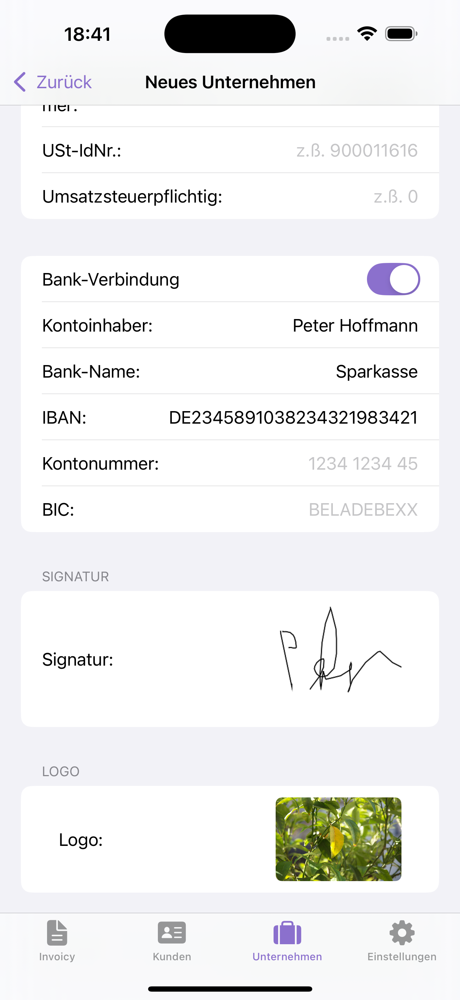

# Invoicy

**Your invoice. My mission.**

Invoicy is the perfect solution for freelancers, small business owners, and self-employed individuals who want to create professional invoices effortlessly. Focus on your work while the app takes care of all the paperwork.  

---

   
   
  
  
  
  
  

---

## Features

- ✅ Fast invoice creation – Generate invoices in just a few taps.  
- ✅ Client management – Store and manage all clients in one place.  
- ✅ Company management – Keep track of multiple companies and their invoices.  
- ✅ Signature support – Companies can save and reuse their own signature.  
- ✅ Logo upload – Add a custom logo to your company, stored locally with SwiftData.  
- ✅ Real invoice preview – See an exact preview before printing or sharing.  
- ✅ Multi-currency support – Use different currencies depending on your needs.  
- ✅ Dark and light mode – Fully supports system appearance.  
- ✅ Automatic localization – Supports English and German based on device language.  
- ✅ PDF export – Create PDF versions of invoices.  
- ✅ Due date – Set a due date for invoices and view it in the invoice list.  
- ✅ No registration or login required – Start using the app immediately.  

---

## Why Invoicy

- Save time with an intuitive workflow.  
- Keep all invoices organized and ready to send.  
- Ideal for freelancers, startups, and small businesses.  

---

##  Download on the App Store   

Check out **Invoicy** on the App Store and download it here for free:

[Invoicy on the App Store](https://apps.apple.com/de/app/invoicy/id6751598755)

---

## Technical Architecture

The app is built with **Swift** and follows the **MVVM (Model-View-ViewModel)** architecture.

- **Models:**  
  Contains data structures and entities, directly handled by SwiftData for local storage.  

- **Views:**  
  All SwiftUI views representing the user interface. Each view is lightweight and retrieves data from its corresponding ViewModel.  

- **ViewModels:**  
  Processes data from models and prepares it for the views. Contains business logic and coordinates communication between views and models.  

- **Repositories:**  
  Acts as an abstraction layer for data access. Handles storage and retrieval from SwiftData.  

---

<!-- ## Testing

The app includes extensive **unit tests** using XCTest to ensure reliability. Key aspects tested include data flow in MVVM and correct PDF generation.  

--- 
--->

## Storage

The app uses **SwiftData** for local data persistence.

**Stored Data:**  
- **User Data:** Signature, uploaded logos, profile settings.  
- **Invoices:** All invoice details, including due dates and multi-currency support.  
- **App Settings:** User preferences such as language and appearance mode.  

---

## Third-Party Libraries

- None required for core functionality – purely Swift, SwiftUI, and SwiftData.  

---

## Future Enhancements

- [ ] Multiple invoice preview templates for users to choose from  
- [ ] Customize invoice template colors individually  
- [ ] Camera access to generate invoices from photos or images  
- [ ] Extend testing coverage with more unit and integration tests

---
